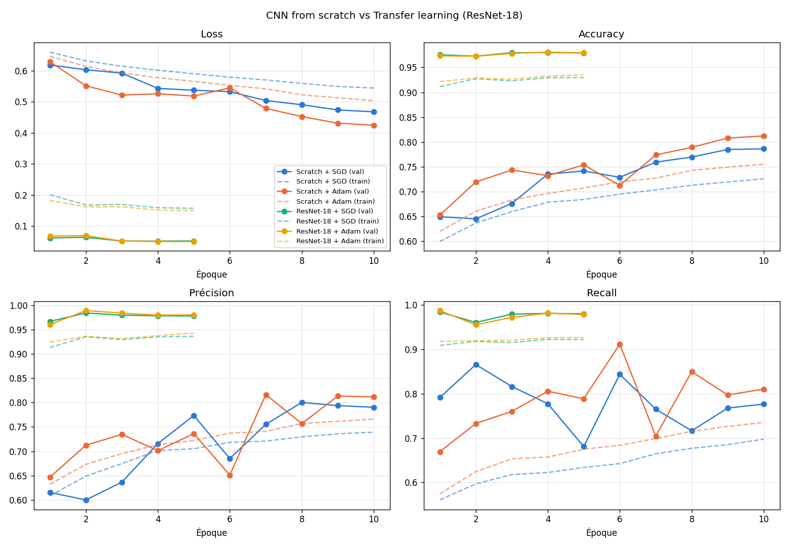
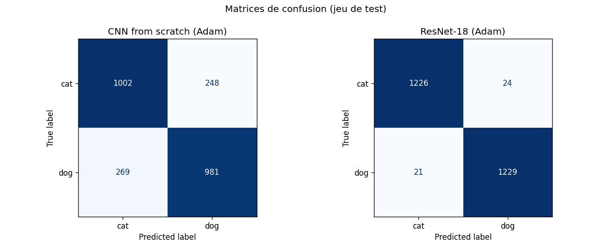
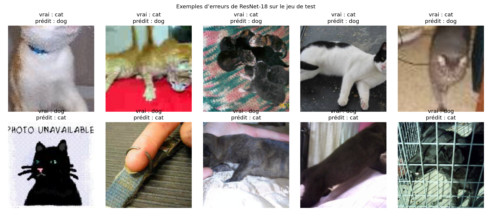

# Classification Chats vs Chiens : CNN from scratch vs Transfer Learning

**Présentée par :** Aicha Codou Arab Ly

## Objectif

Ce projet compare deux approches de classification d'images sur le jeu de données **Cats vs Dogs** :

- **Expérience A : CNN from scratch.** Réseau convolutif à 4 blocs, entièrement entraîné à partir de zéro.
- **Expérience B : Transfer learning.** ResNet-18 pré-entraîné sur ImageNet, dont seule la dernière couche est remplacée et entraînée.

L'objectif est de mesurer l'impact du transfert d'apprentissage sur la **vitesse de convergence**, les **performances** (accuracy, précision, recall) et la **robustesse** du modèle.

## Structure du dépôt

```
cnn-catsdogs-LY_Aicha-Codou-Arab/
├─ notebook.ipynb      avec le code complet, un petit rapport dans les Markdowns + les résultats
├─ requirements.txt    avec les bibliothèques Python nécessaires
├─ .gitignore          en excluant les données et les modèles (.pt)
├─ figures/            avec les courbes, les matrices de confusion et les erreurs
└─ README.md
```

## Environnement

Le projet a été réalisé sur **Google Colab** avec un **GPU T4**. La disponibilité du GPU est vérifiée au début du notebook avec device = cuda .

**Google Colab**
1. Ouvrir `notebook.ipynb` dans Google Colab.
2. Activer le GPU : `Exécution → Modifier le type d'exécution → T4 GPU`.
3. Exécuter les cellules dans l'ordre.

**En local**
```bash
pip install -r requirements.txt
jupyter notebook notebook.ipynb
```

## Données

Jeu de données *Dogs vs Cats* (Kaggle), dans la version organisée par Udacity :
https://s3.amazonaws.com/content.udacity-data.com/nd089/Cat_Dog_data.zip

Le notebook télécharge et décompresse automatiquement les données dans `/content/Cat_Dog_data` :
```python
!wget -q https://s3.amazonaws.com/content.udacity-data.com/nd089/Cat_Dog_data.zip
!unzip -q Cat_Dog_data.zip
```

Structure attendue (format `ImageFolder`) :
```
Cat_Dog_data/
├─ train/   cat/  dog/    (22 500 images)
└─ test/    cat/  dog/    (2 500 images)
```

Les données ne sont pas versionnées sur GitHub (voir `.gitignore`).

**Découpage :** le dossier `train` est séparé aléatoirement en **80 % entraînement (18 000 images)** et **20 % validation (4 500 images)**, avec un seed fixé à 42. La validation sert à comparer les configurations et à sélectionner le meilleur modèle. Le jeu de **test (2 500 images)** n'est utilisé qu'une seule fois, pour l'évaluation finale.

## Prétraitement

| | Entraînement | Validation / Test |
|---|---|---|
| Redimensionnement | `RandomResizedCrop(224)` | `Resize(255)` + `CenterCrop(224)` |
| Augmentation | `RandomHorizontalFlip`, `RandomRotation(15)` | aucune |
| Normalisation | moyenne et écart-type ImageNet | moyenne et écart-type ImageNet |

## Entraînement

Tous les entraînements se lancent depuis le notebook, avec la fonction `fit(nom, model, optimizer, epochs)`.

**Paramètres communs :** batch size 64, fonction de perte `CrossEntropyLoss`, weight decay 1e-4, scheduler `CosineAnnealingLR`, seed 42 (réinitialisé avant chaque entraînement).

**Expérience A : CNN from scratch** (`ScratchCNN`, 422 530 paramètres)
- 4 blocs `Conv2d 3×3 → BatchNorm2d → ReLU → MaxPool2d` (32, 64, 128 puis 256 filtres)
- `AdaptiveAvgPool2d` → `Dropout(0.5)` → `Linear(256,128)` → `ReLU` → `Dropout(0.5)` → `Linear(128,2)`
- 10 époques
- SGD (lr = 0,01, momentum = 0,9) et Adam (lr = 0,001)

```python
set_seed()
model = ScratchCNN().to(device)
optimizer = optim.Adam(model.parameters(), lr=0.001, weight_decay=1e-4)
hist = fit('scratch_adam', model, optimizer, epochs=10)
```

**Expérience B : Transfer learning** (`build_resnet`, ResNet-18 pré-entraîné ImageNet)
- Toutes les couches du réseau pré-entraîné sont **gelées** (extraction de caractéristiques).
- La couche finale est remplacée par : `Linear(512,256)` → `BatchNorm1d` → `ReLU` → `Dropout(0.5)` → `Linear(256,2)`.
- Seuls 132 354 paramètres sur 11,3 millions sont entraînés.
- 5 époques
- SGD (lr = 0,01, momentum = 0,9) et Adam (lr = 0,001), appliqués à `model.fc.parameters()` uniquement

```python
set_seed()
model = build_resnet().to(device)
optimizer = optim.Adam(model.fc.parameters(), lr=0.001, weight_decay=1e-4)
hist = fit('tl_adam', model, optimizer, epochs=5)
```

**Choix de la régularisation :**
- **Batch Normalization** : placée après chaque convolution, avant la ReLU. Elle stabilise la distribution des activations, accélère la convergence et réduit la sensibilité à l'initialisation.
- **Dropout** : placé uniquement dans le classifieur (couches entièrement connectées), là où se concentre le risque de sur-apprentissage.

**Learning rate :** les valeurs initiales de référence (0,01 pour SGD, 0,001 pour Adam) sont ensuite ajustées automatiquement par le scheduler `CosineAnnealingLR`, qui fait décroître progressivement le learning rate jusqu'à la fin de l'entraînement.

## Sauvegarde et rechargement du modèle

À chaque amélioration de l'accuracy de validation, les poids du modèle sont sauvegardés localement (dossier Google Drive, **non versionné sur GitHub**) :
```
/content/drive/MyDrive/cnn_catsdogs/checkpoints/<nom>.pt
```
Fichiers produits : `scratch_sgd.pt`, `scratch_adam.pt`, `tl_sgd.pt`, `tl_adam.pt`.

Rechargement pour l'évaluation finale :
```python
model = build_resnet().to(device)
model.load_state_dict(torch.load('/content/drive/MyDrive/cnn_catsdogs/checkpoints/tl_adam.pt', map_location=device))
model.eval()
```

## Résultats

### Validation (meilleure époque de chaque configuration)

| Configuration | Optimiseur | Époques | Accuracy val. (1ʳᵉ époque) | Meilleure accuracy val. |
|---|---|---|---|---|
| CNN from scratch | SGD | 10 | 64,9 % | 78,6 % |
| CNN from scratch | Adam | 10 | 65,3 % | 81,2 % |
| ResNet-18 (transfer) | SGD | 5 | 97,6 % | 98,0 % |
| ResNet-18 (transfer) | Adam | 5 | 97,4 % | **98,1 %** |

### Test final (meilleurs modèles rechargés)

| Modèle | Accuracy | Précision | Recall | Erreurs / 2 500 |
|---|---|---|---|---|
| A : CNN from scratch (Adam) | 79,32 % | 79,82 % | 78,48 % | 517 |
| B : ResNet-18 (Adam) | **98,20 %** | **98,08 %** | **98,32 %** | **45** |

### Courbes d'apprentissage



### Matrices de confusion (jeu de test)



### Exemples d'erreurs de ResNet-18



## Analyse

**Convergence.** Le transfert d'apprentissage accélère considérablement la convergence. Dès la première époque, ResNet-18 atteint 97,5 % d'accuracy de validation, alors que le CNN from scratch démarre autour de 65 % et n'atteint que 81 % après dix époques. Le réseau pré-entraîné dispose déjà de caractéristiques visuelles génériques (contours, textures, formes, parties d'animaux) apprises sur 1,2 million d'images : seul le classifieur final doit être adapté. Le CNN from scratch doit au contraire tout apprendre à partir de 18 000 images, et sa loss continue de diminuer à la dernière époque, signe qu'il n'a pas encore convergé.

**Performance et robustesse.** Sur le jeu de test, le transfer learning atteint 98,2 % d'accuracy contre 79,3 % pour le CNN from scratch, soit un gain d'environ 19 points et onze fois moins d'erreurs (45 contre 517), en deux fois moins d'époques et en n'entraînant qu'environ 1 % des paramètres. Les résultats de test sont très proches de ceux de validation pour les deux modèles, ce qui indique une bonne généralisation. Les courbes de précision et de recall du CNN from scratch oscillent fortement d'une époque à l'autre, tandis que celles de ResNet-18 restent stables et équilibrées. Les erreurs restantes de ResNet-18 concernent surtout des images floues, sombres, sans visage visible, avec un contexte trompeur (collier, cage), voire mal étiquetées (une vignette « PHOTO UNAVAILABLE » représentant un chat est étiquetée « dog »).

**Optimiseurs.** Pour le CNN from scratch, Adam converge plus vite que SGD (71,9 % contre 64,5 % à la deuxième époque) et obtient une meilleure performance finale (81,2 % contre 78,6 %). Pour le transfer learning, les deux optimiseurs donnent des résultats quasiment identiques (98,0 % et 98,1 %) : lorsque le point de départ est déjà très bon, le choix de l'optimiseur a peu d'influence. Dans toutes les configurations, les performances de validation sont supérieures à celles d'entraînement, en raison de l'augmentation de données et du Dropout actifs uniquement pendant l'entraînement : aucun sur-apprentissage n'est observé.

## Limites et pistes d'amélioration

- Le CNN from scratch n'a pas convergé en 10 époques : un entraînement plus long améliorerait ses performances.
- Chaque configuration n'a été entraînée qu'avec un seul seed. Répéter les expériences sur plusieurs seeds permettrait d'estimer la variabilité des résultats.
- Les images de validation proviennent du même dossier que l'entraînement. Une validation croisée donnerait une estimation plus robuste.
- Pour le transfer learning, seul le classifieur est entraîné. Un fine-tuning des dernières couches convolutionnelles pourrait encore améliorer les résultats.
- La recherche du learning rate s'est limitée aux valeurs de référence et au scheduler. Un *LR range test* ou une recherche plus systématique d'hyperparamètres serait plus rigoureux.
- Le jeu de données contient quelques images mal étiquetées ou non représentatives, qui limitent la performance maximale atteignable.

***vidéo de présentation :*** https://drive.google.com/file/d/1SSPyEmOR5arHbKDxGEe0HfNe6QHdQ1nN/view?usp=drive_link
